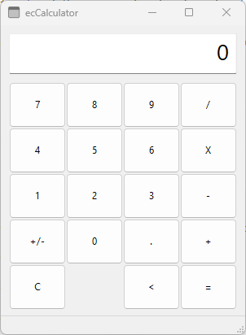
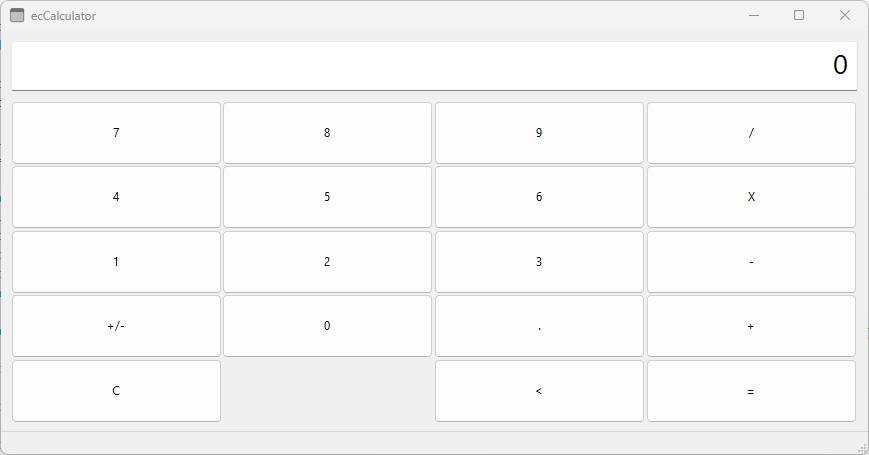
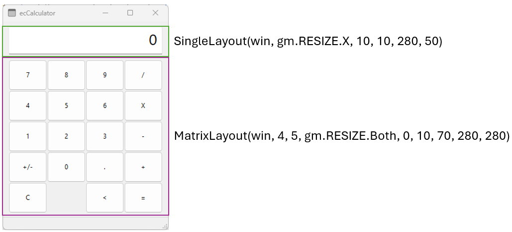

# example calculator

This project is a simple calculator application. It uses the ui module of LuaRT with the Geometry and Key Manager.

It is intended to show how ui widgets can be automatically placed in a window. When the window size is changed, the ui widgets are displayed accordingly. It also shows how keys are bound to a ui button and their onClick event is executed.

**This is a demonstration project only.**

## License

Copyright (c) 2023 by esferatec.
It is open source, released under the MIT License.
See full copyright notice in the LICENSE.md file.
