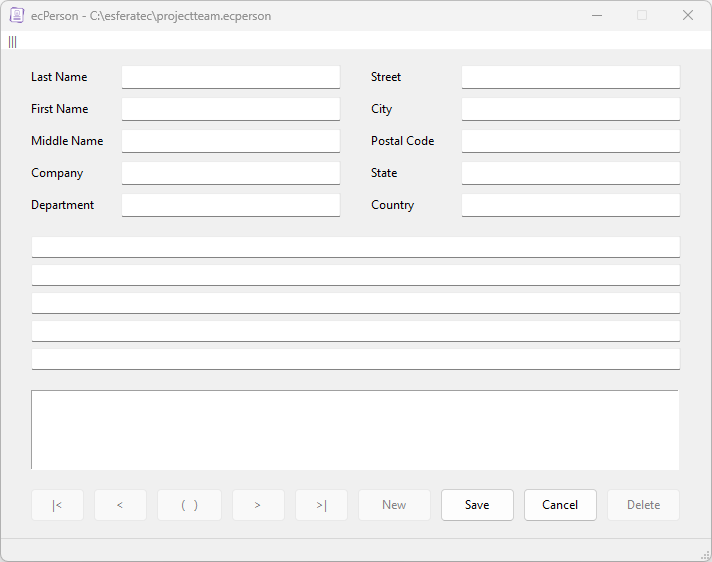
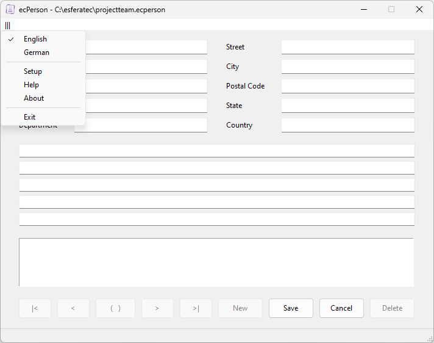
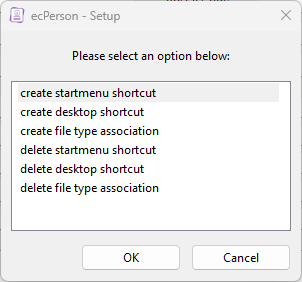
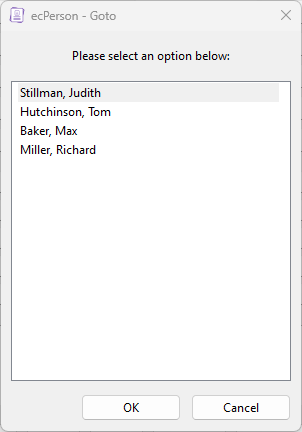
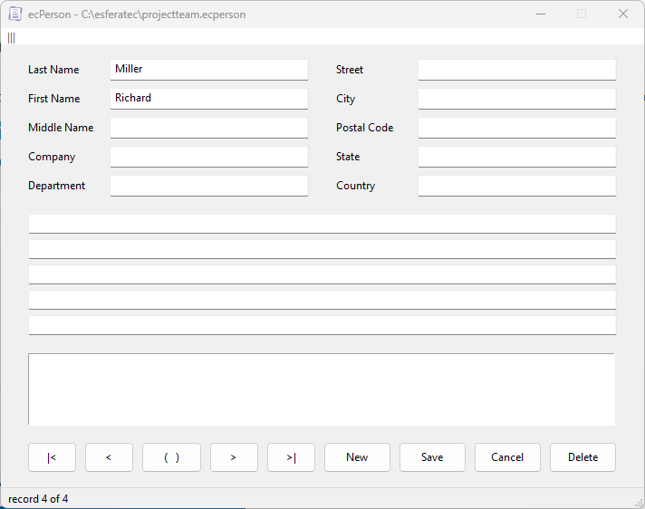

# ecPerson

This is a small and easy to use application for managing persons.
You can create an person management file in any directory. In this file, you can store the necessary details for each person.
This programme is designed to manage a small, limited number of persons.
It stores the information in a SQLite database.

## License

Copyright (c) 2023 by esferatec.
It is open source, released under the MIT License.
See full copyright notice in the LICENSE.md file.
