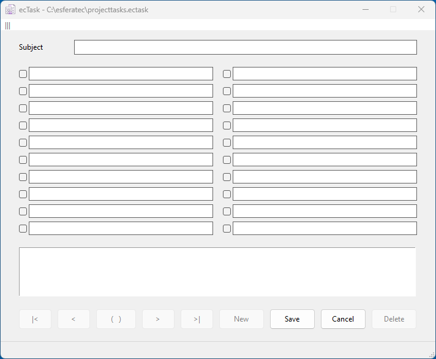
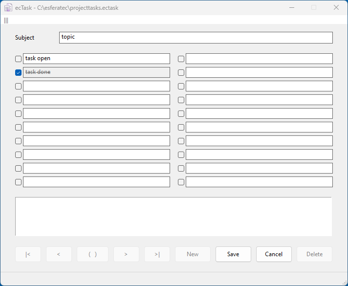
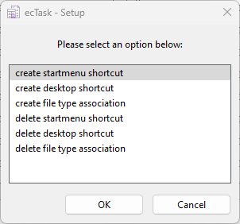
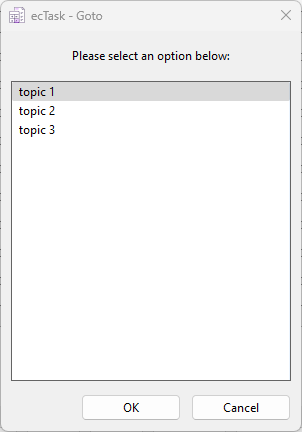
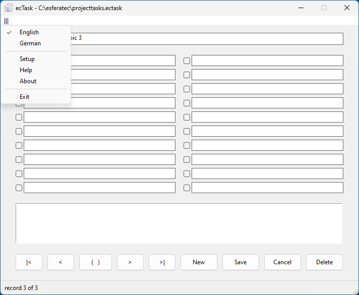

# ecTask

This is a small and easy to use application for managing tasks.
You can create an task management file in any directory. In this file, you can store the necessary details for each task.
This application is designed to manage a small, limited number of tasks.
It stores the tasks in a SQLite database.

## License

Copyright (c) 2023 by esferatec.
It is open source, released under the MIT License.
See full copyright notice in the LICENSE.md file.
